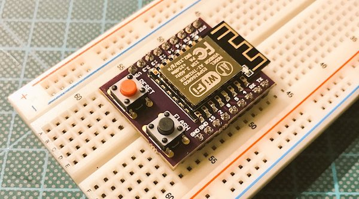
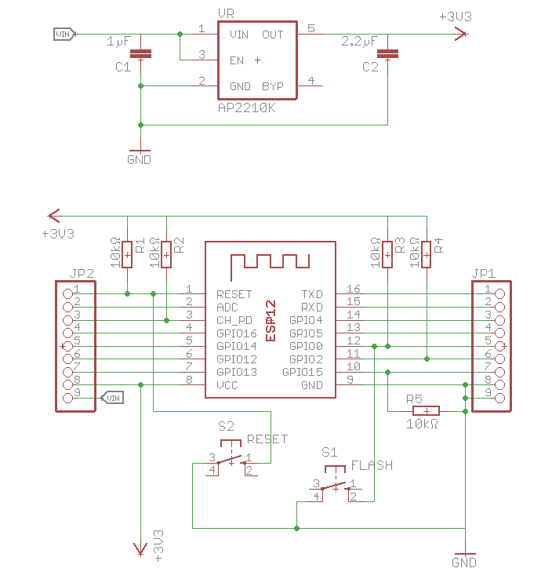
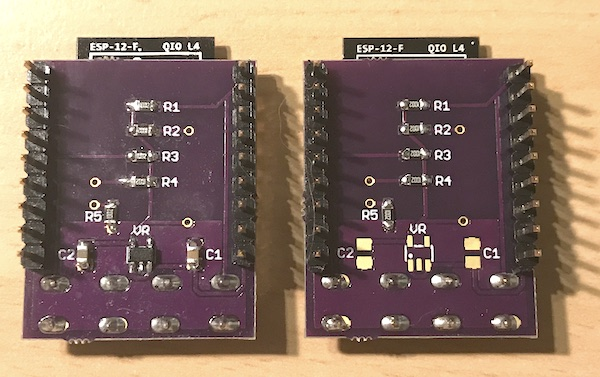

# ESP8266 minimal proto board / breadboard adaptor

This is a simple yet useful breadboard adaptor for the all famous ESP8266.

I've built this as the cheap chinese ones (white boards) are to wide to fit on a regular breadboard. To develop an own design you often don't need a full grown [Adafruit Huzzah](https://www.adafruit.com/product/2471), [Olimex MOD-WIFI-ESP8266-DEV](https://www.olimex.com/Products/IoT/MOD-WIFI-ESP8266-DEV/open-source-hardware) or similar ESP8266 devboard. Also the cheap chinese ones don't have a reset and/or flash button. I don't want to wire the needed resistors and a flash/reset button every time I'm putting an ESP on a breadboard.

Inside the folders you'll find the Eagle schematics and board files.

## Schematics

## Get it working...
You can simply solder some male headers and an ESP-12(E/F/Q), ESP-07 or ESP-14 on top of the board and are ready to go. 

The better way will be to at least solder some 10kΩ resistors (`R1-R5`) to have the needed pull-ups/pull-downs to get the ESP working. Obviously it is also a good idea to solder the two push buttons so you have the reset and flash funcionality. Then power it up with 3.3 Volts and you are good to go.

The buttons are the very common 6x6mm variant which goes by `switch-omron`. In Germany you can source the from [Reichelt](https://www.reichelt.de/Kurzhubtaster/TASTER-9302/3/index.html?ACTION=3&LA=2&ARTICLE=44579&GROUPID=7587&artnr=TASTER+9302&SEARCH=%252A) for example. But every electronics shop should have them in stock.

Optionally you can solder a [LDO](https://en.wikipedia.org/wiki/Low-dropout_regulator) to power the ESP with more than 3.3 Volts, as shown on the left side:

## 0805 Version

You'll need 5 x SMD 0805 10kΩ resistors (`R1-R5`) and the two push-buttons. The 0805 resistor should be available from your prefered electronic store.

If you want to use the LDO you need the [AP2210K](https://www.diodes.com/assets/Datasheets/AP2210.pdf), a `SOT-23-5` LDO which can be powered with up to 13.2 Volts and only needs two capacitors (`C1/C2`) to run smooth. `C1` is `1µF`, `C2` is `2.2µF` in a 0805 package. It delivers up to 300mA which is fairly enough to power the ESP8266 - you have some room for periphals ;-)

You can use any other `SOT-32-5` LDO which supplies 3.3 Volts with at least 120-150mA, is satisfied with two capacitors and has the same pinout.

The boards can be ordered from [OSH Park](https://oshpark.com/shared_projects/uqfHarcP)

## 1206 Version
This is not finished yet and the repo only holds the work-in-progress version...

## Credits
Patrik Mayer, cod.m GmbH, 2017

Inspired by [tiny ESP8266 breakout](https://github.com/skorokithakis/tiny-ESP8266-breakout) from Stavros Korokithakis

## License
[CC-BY-SA](https://creativecommons.org/licenses/by-sa/3.0/) 

